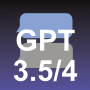
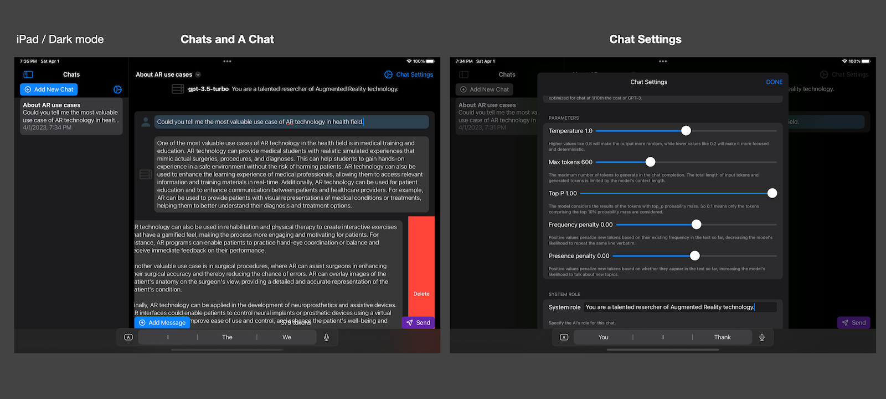
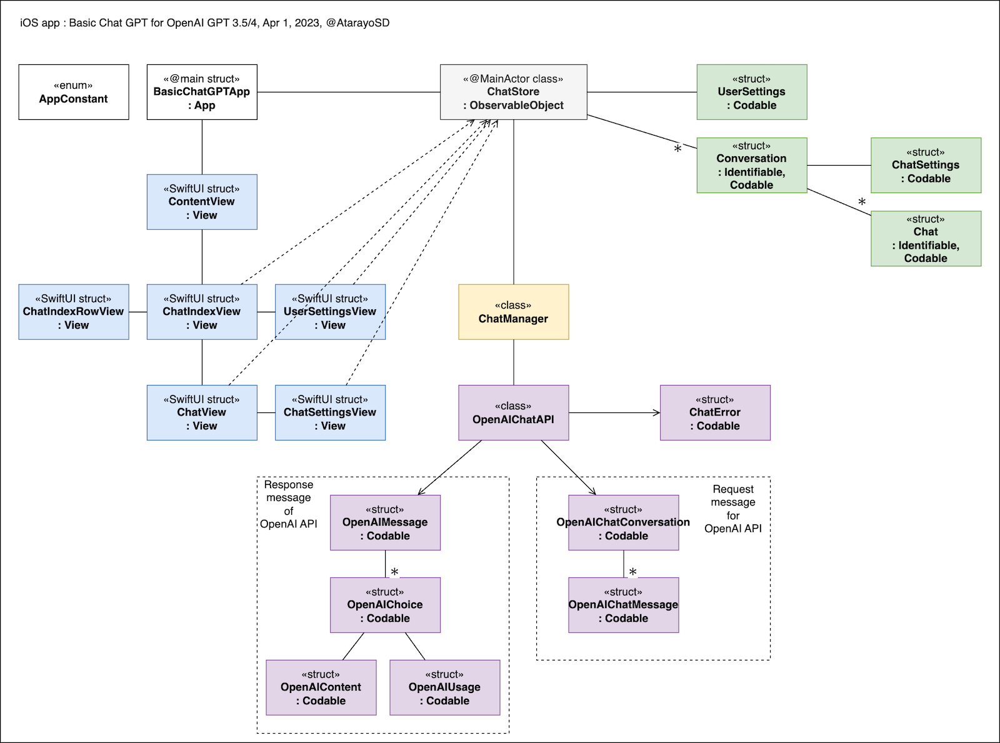

# iOS app - Basic Chat GPT 3.5/4

A minimal iOS app that interacts with OpenAI Chat GPT-3.5/4.

- Target devices: iPhone / iPad / Mac with M1/M2 (Designed for iPad)
- Target OS: iOS 16.0+, iPadOS 16.0+, macOS 13.0+
- Build system: Xcode 14.3+
- SDK: SwiftUI

## Change Log

- [1.2 (2)] - Apr 2, 2023 [Added]
    - In the chat view, a button on a keyboard was added to hide.
- [1.1 (1)] - Apr 2, 2023 [Added]
    - In the chat view, messages can be moved in the conversation in addition to deletion. 
    You can reconstruct the conversation more flexibly.

## Abstract

This is a minimal iOS app that communicates with OpenAI Chat GPT 3.5/4 via OpenAI API.
The purpose of this project is showing a very basic sample code which communicates with OpenAI GPT 3.5/4.
The project handles the OpenAI API directly.

In order to use the OpenAI API, you need to sign up to the OpenAI website and get the API key.
First you are given free credits. When it is used up, it is necessary to subscribe to a paid service.
In addition to that, GPT-4 is under the limited service, so you need to entry to the waiting list first.
After invited to GPT-4, you will be able to use the GPT-4 models.
The API Key can be used for both GPT-3.5 and GPT-4.
Until then, please use GPT-3.5 models.

### Features

- Users can set their API Key in User Settings, to use the OpenAI API for GPT-3.5/4.
- Users can make any number of conversations and delete them.
- In conversations, users can send messages to OpenAI GPT. Users can reconstruct the messages by editing text or deleting messages, or moving messages' position in the conversation. This will change the conversation's direction.
- For each conversation, users can configure GPT's behavior by changing Chat Setting such as GPT model, parameters and system role.

### Usage

1. Set your API Key in the User Setting. This will be stored in UserDefaults.
1. Add a conversation and select it.
1. Add a message of user or assistant (AI) and edit the content.
1. Send the conversation to OpenAI GPT.
1. The response from OpenAI GPT will be shown. The conversation will be stored in a file on a device.
1. Edit/delete/move any messages and re-send the conversation to OpenAI GPT.
1. You will be receive different conversation this time.

<!--  -->

## Preparation to build and run the project

### Get the OpenAI API Key

The API Key for OpenAI API is required.
You need to sign up to OpenAI site (https://openai.com/api/) and get the key.
You can get the key at the account management page. (https://platform.openai.com/account/)

### Check your credits

To use the OpenAI API, you need credits. You will get some free credits when you sign up.
After using it, you need to purchase a paid subscription.
It is reasonable because the computational cost of LLM is very high.

If your API Key is invalid or your credits are short, the API calls will fail.

## OpenAI GPT Models

- GPT-4 [Limited beta] : More capable than any GPT-3.5 model, able to do more complex tasks, and optimized for chat. Will be updated with our latest model iteration.
- GPT-3.5-turbo : Most capable GPT-3.5 model and optimized for chat at 1/10th the cost of text-davinci-003.

## Design

### Type Structure and State Machines

The app consists of simple SwiftUI Views, a View Model, Models, a Manager, and OpenAI modules.

## References

- OpenAI API : https://openai.com/api/
- OpenAI Guide - Chat completions : https://platform.openai.com/docs/guides/chat/chat-completions-beta
- OpenAI Models : https://platform.openai.com/docs/models/models
- OpenAI API Reference - Completions : https://platform.openai.com/docs/api-reference/completions
- OpenAI Playground : https://platform.openai.com/playground
- adamrushy/OpenAISwift Swift Package: https://github.com/adamrushy/OpenAISwift

## License

